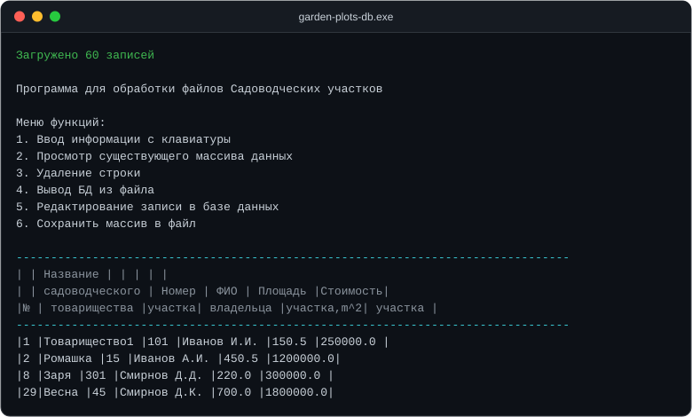

# garden-plots-db


A C++ program that keeps a list of garden plots: file I/O, sorting, a summary and a search.



## About

The program keeps a list of garden plots: keyboard input, reading from and writing to a
file, editing and deleting records, sorting, a summary by garden association, and a search
by price. I built it while working through my C++ course, so the earlier versions are
collected in `archive/`, from plain arrays up to inheritance.

The program's interface is in Russian; the code and this readme are in English.

## What it does

- enter records from the keyboard, load them from a file and save them back;
- view, delete and edit records;
- sort by price, by owner, and by association plus owner;
- summary: groups plots by association and counts them;
- search for plots above a given price, with sorting of the results;
- checks for the copy constructor and the assignment operator.

## Data format

A text file with one record per line:

```
<association> <number> <surname> <initials> <area> <price>
```

Example (`data/plots.txt`):

```
Товарищество1 101 Иванов И.И. 150.5 250000
Ромашка 15 Иванов А.И. 450.5 1200000
```

## Build and run

You need Windows and Visual Studio 2022 with the "Desktop development with C++" workload.

In Visual Studio: open `garden-plots-db.sln`, build `Release | x64`, run.

With MSBuild:

```powershell
msbuild garden-plots-db.sln /p:Configuration=Release /p:Platform=x64
```

With CMake:

```powershell
cmake -B build -A x64
cmake --build build --config Release
```

Run `garden-plots-db.exe`, choose item 4 and enter `data/plots.txt` to load the sample
database of 60 records.

## How it works

The classes form an inheritance chain: `PlotArray → PlotSummary → PlotSearch`. The plot
array is extended by a summary and then by a search. The diagram and details are in
`docs/ARCHITECTURE.md`.

Project layout:

```
garden-plots-db/
├── src/              # final version (inheritance)
│   ├── main.cpp
│   ├── plot.h/.cpp
│   ├── plot_array.h/.cpp
│   ├── plot_summary.h/.cpp
│   └── plot_search.h/.cpp
├── data/             # sample database and output examples
├── archive/          # earlier stages (01…08)
├── docs/
└── screenshots/
```

How the project grew with each course topic is described in `docs/PROGRESSION.md`.

## What I would change

It is a study project, and that shows in a few places:

- memory is managed by hand (`new`/`delete`). Today I would use `std::vector` and `std::string`;
- the screen is cleared and paused via `system("cls")` and `system("pause")`, where WinAPI calls would be better;
- there are no tests. The sorting and search logic deserves at least a few checks;
- it only runs on Windows because of the console API.

## License

MIT. Free to use, see [`LICENSE`](LICENSE) for details.

## Author

Ilya, [github.com/Ilya0107](https://github.com/Ilya0107). Russian version of this file:
[README.md](README.md).
