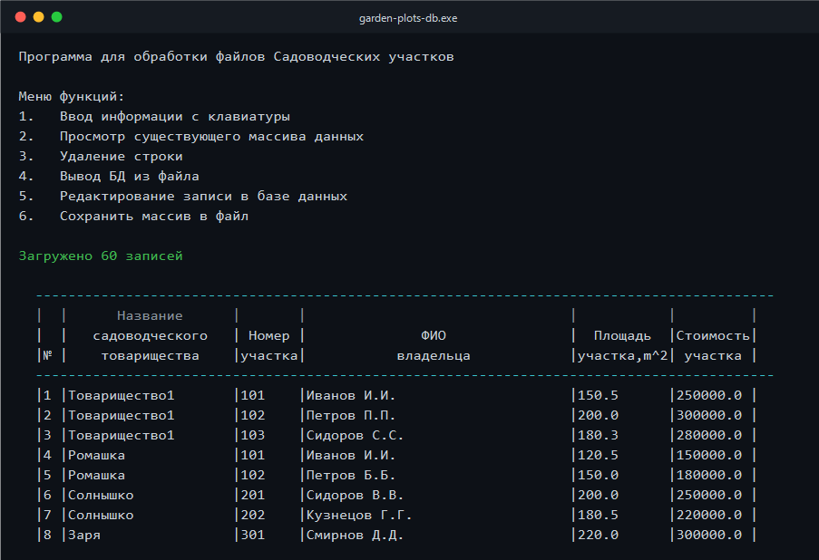

# garden-plots-db


Программа на C++ для учёта садоводческих участков: файлы, сортировки, перечень и поиск.



## О проекте

Программа ведёт список садоводческих участков: ввод с клавиатуры, чтение и запись файла,
правка и удаление записей, сортировки, перечень по товариществам и поиск по цене. Делал
её по ходу курса, поэтому ранние версии собраны в `archive/`: от простых массивов до
наследования.

## Что умеет

- ввод записей с клавиатуры, загрузка из файла и сохранение обратно;
- просмотр, удаление и редактирование;
- сортировка по цене, по владельцу, а также по товариществу и владельцу;
- перечень: группирует участки по товариществам и считает количество;
- поиск участков дороже заданной цены с сортировкой результатов;
- проверка конструктора копирования и оператора присваивания.

## Формат данных

Текстовый файл, одна запись на строку:

```
<товарищество> <номер> <фамилия> <инициалы> <площадь> <стоимость>
```

Пример (`data/plots.txt`):

```
Товарищество1 101 Иванов И.И. 150.5 250000
Ромашка 15 Иванов А.И. 450.5 1200000
```

## Сборка и запуск

Нужны Windows и Visual Studio 2022 с рабочей нагрузкой «Разработка классических
приложений на C++».

В Visual Studio: откройте `garden-plots-db.sln`, соберите `Release | x64`, запустите.

Через MSBuild:

```powershell
msbuild garden-plots-db.sln /p:Configuration=Release /p:Platform=x64
```

Через CMake:

```powershell
cmake -B build -A x64
cmake --build build --config Release
```

Запустите `garden-plots-db.exe`, выберите пункт 4 и укажите файл `data/plots.txt`, чтобы
загрузить тестовую базу из 60 записей.

## Как устроено

Классы выстроены в цепочку наследования: `PlotArray → PlotSummary → PlotSearch`. Массив
участков расширяется перечнем, а затем поиском. Диаграмма и детали в
[`docs/ARCHITECTURE.md`](docs/ARCHITECTURE.md).

Структура проекта:

```
garden-plots-db/
├── src/              # финальная версия (наследование)
│   ├── main.cpp
│   ├── plot.h/.cpp
│   ├── plot_array.h/.cpp
│   ├── plot_summary.h/.cpp
│   └── plot_search.h/.cpp
├── data/             # примеры базы данных и результатов
├── archive/          # ранние этапы (01…08)
├── docs/
└── screenshots/
```

Как проект развивался по темам курса, описано в
[`docs/PROGRESSION.md`](docs/PROGRESSION.md).


## Лицензия

MIT. Можно свободно использовать, подробности в [`LICENSE`](LICENSE).

## Автор

Илья, [github.com/Ilya0107](https://github.com/Ilya0107). Английская версия этого файла —
[README.en.md](README.en.md).
