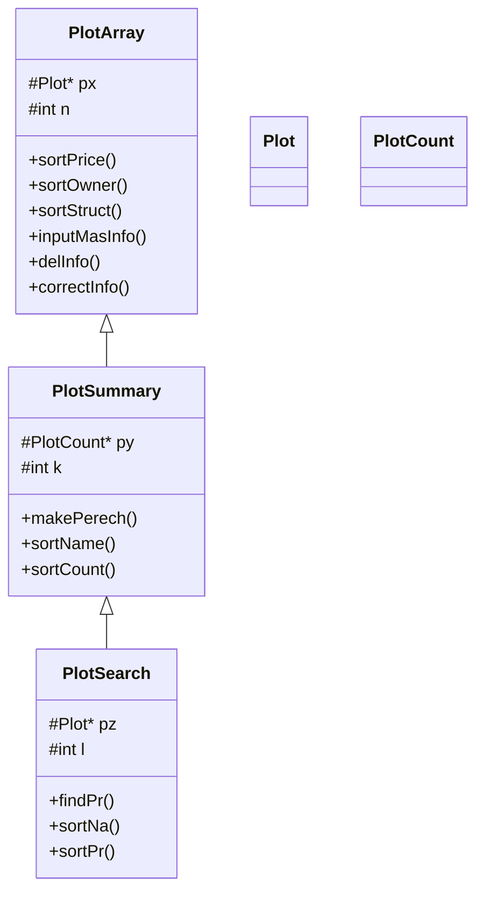

# Архитектура / Architecture

## О чём проект

Консольная программа для работы с базой садоводческих участков. Запись содержит
название товарищества, номер участка, ФИО владельца, площадь и стоимость. Программа
умеет вводить данные с клавиатуры, загружать из файла и сохранять в файл, удалять и
редактировать записи, сортировать, строить перечень по товариществам и искать участки
дороже заданной цены.

## Модель данных

```
struct Plot {           // одна запись об участке
    string name;        // название садоводческого товарищества
    int    num;         // номер участка
    string owner;       // ФИО владельца
    double area;        // площадь, м^2
    double price;       // стоимость
};

struct PlotCount {      // строка перечня: товарищество + число участков
    string name;
    int    count;
};
```

Для обеих структур перегружены `operator>>` и `operator<<`, для `Plot` — ещё и
`operator>` (сравнение по названию товарищества, затем по владельцу).

## Иерархия классов (финальная версия)



- **`PlotArray`** — динамический массив записей: добавление, удаление, правка,
  сортировки, файловый ввод/вывод.
- **`PlotSummary`** (`public PlotArray`) — перечень: группирует участки по
  товариществам и считает их количество.
- **`PlotSearch`** (`public PlotSummary`) — результат поиска: участки дороже заданной
  цены, с сортировками.

Наследование отражает «расширение» базовой сущности, а агрегация (этап 08 в `archive/`)
делает то же через владение — см. [`PROGRESSION.md`](PROGRESSION.md).

## Формат файла данных

Каждая строка — одна запись:

```
<товарищество> <номер> <фамилия> <инициалы> <площадь> <стоимость>
```

Пример (`data/plots.txt`):

```
Товарищество1 101 Иванов И.И. 150.5 250000
Ромашка 15 Иванов А.И. 450.5 1200000
```

Фамилия и инициалы считываются двумя строками и объединяются в одно поле `owner`.

## Технические решения

- **C++20**, MSVC (Visual Studio 2022), консольное приложение.
- **UTF-8**: исходники в UTF-8, флаг `/utf-8`, консоль переключается на `CP_UTF8`
  (`SetConsoleOutputCP`/`SetConsoleCP`) — кириллица корректна и в коде на GitHub, и при
  запуске.
- **Ручное управление памятью** (`new`/`delete`) — намеренно: тема курса. Классы
  реализуют конструктор копирования и `operator=` (правило трёх).
- Проект собирается как через Visual Studio / MSBuild, так и через CMake.

## Ранние этапы

Папка `archive/` содержит снапшоты более ранних версий (от одномерных массивов и
динамической памяти до агрегации). Подробнее — в [`PROGRESSION.md`](PROGRESSION.md).
